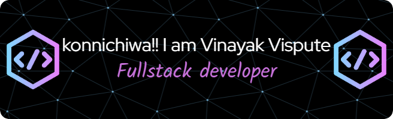

<h3 align="left">- A Passionate Student Highly Interested in Cyber Security ,Web3 Security ,IOT ,Blockchain and in Artificial Intelligence and Machine Learning</h3>

- 🌱 I’m currently learning **NextJs, TypeScript & System Design**

- 📫 How to reach me **vinayakvispute4@gmail.com**

- ⚡ Fun fact **Banging your head against a wall for one hour burns 150 calories.**
- 🖥 4 times Hackathon Winner 🏆🎉🏆
- 💬 Ask me About **Anime ,PC Setups and CyberSecurity**

 

  
 
 

 
<h4 align="center">⚡️I don’t trust people who don’t write SQL queries in uppercase⚡️</h4>
 

 

## 🛠  Programming Languages

 

## 📖  Frontend Development

 

## 👾 Backend Development

 

## 👾 Database

 

## 📚 Cache && Messaging

 

## ☁️ Cloud Services

## 🌐 Version Control

 
 
 
 
## 🏗️ IDE I used as per conditions

 
 
 
 

## 📱 Contact Me :

  

If you want to reach out to me about anything, be it some doubt or just to hangout and talk 😉.
I am always ready to talk.

 
 
 
</a>

 

  

<h1 align="center" dir="auto"><a id="user-content-️stay-awesome️" class="anchor" aria-hidden="true" href="#️stay-awesome️"><svg class="octicon octicon-link" viewBox="0 0 16 16" version="1.1" width="16" height="16" aria-hidden="true"><path fill-rule="evenodd" d="M7.775 3.275a.75.75 0 001.06 1.06l1.25-1.25a2 2 0 112.83 2.83l-2.5 2.5a2 2 0 01-2.83 0 .75.75 0 00-1.06 1.06 3.5 3.5 0 004.95 0l2.5-2.5a3.5 3.5 0 00-4.95-4.95l-1.25 1.25zm-4.69 9.64a2 2 0 010-2.83l2.5-2.5a2 2 0 012.83 0 .75.75 0 001.06-1.06 3.5 3.5 0 00-4.95 0l-2.5 2.5a3.5 3.5 0 004.95 4.95l1.25-1.25a.75.75 0 00-1.06-1.06l-1.25 1.25a2 2 0 01-2.83 0z"></path></svg></a><g-emoji class="g-emoji" alias="zap" fallback-src="https://github.githubassets.com/images/icons/emoji/unicode/26a1.png">⚡️</g-emoji><i>Stay awesome!</i><g-emoji class="g-emoji" alias="zap" fallback-src="https://github.githubassets.com/images/icons/emoji/unicode/26a1.png">⚡️</g-emoji></h1>

